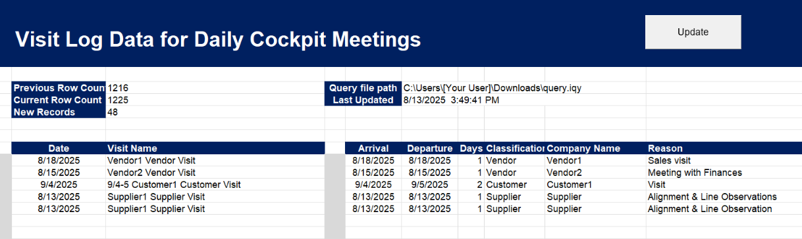

# SharePoint List New Records Filter (Excel VBA)

This is a small Excel VBA macro that helps track **new records** from a SharePoint list export.  
It works by importing data through a `.iqy` query file, processing the records, and updating an output area that shows the latest additions, perfect to copy and paste.
It displays the date and a custom visit name (which differentiate between internal and non-internal visit), then some visit details if review is needed.
This macro does not differentiate the events when a misspeling exists (as showed on the screenshot).

⚠️ **Note:** This repo only contains the VBA code. No internal company data or Excel file with sensitive info is included. Screenshot also shows manually modified data.  
You can copy the module into your own workbook following the setup instructions below.
Adjust the cells and fields to fit on your SharePoint List export format. Also, feel free to modify the custom Visit Name.



---

## 📋 Requirements
- Microsoft Excel (desktop version with support for QueryTables and VBA).
- A SharePoint list where you can use **Export to Excel**, which generates a `.iqy` file.

---

## ⚙️ Setup Instructions

1. **Excel Workbook Structure**  
   Your workbook must contain the following sheets:
   - `Information` → control sheet with file path and counters.
   - `VisitorsRawData` → raw data imported from SharePoint.
   - `ProcessedVisitors` → processed and grouped data.

2. **Cells used**  
   - `Information!F4` → place the full file path of the `.iqy` file here.  
   - `Information!C4` → previous record count (auto-filled).  
   - `Information!C5` → current record count (auto-filled).  
   - `Information!C6` → number of new records (auto-filled).  
   - `Information!F5` → last consulted date (auto-filled).  
   - `Information!B10:K1000` → new records section (auto-filled).

3. **Button setup**  
   Add a button in the `Information` sheet and assign it to the macro:
   ```vba
   Button_Click
   ```

This will trigger the full process (download, process, compare, and update).

4. **Exporting from SharePoint**

   * Go to your SharePoint list.
   * Use **Export to Excel**, which gives you a `.iqy` file.
   * Save it locally and paste its path into `Information!F4`.

---

## ▶️ Usage

* Click the **Update** button.
* The macro will:

  1. Import the SharePoint list via the `.iqy`.
  2. Process and group the data.
  3. Compare with the previous record count.
  4. Display only the new records in `Information!B10:K1000`.
  5. Update the “Last consulted” timestamp.

---

## 📂 Project Contents

* `SharePointNewRecords.bas` → the VBA module containing all macros:

  * `Button_Click`
  * `CheckFilePath`
  * `DownloadDataFromIQY`
  * `ProcessVisitorsData`
  * `CountPreviousRecords`
  * `CountCurrentRecords`
  * `CheckIfNewRecords`
  * `BringNewRecords`
  * `PrintLastConsultedDate`

---

## ⚠️ Notes

* This macro relies on SharePoint’s legacy `.iqy` export (using `owssvr.dll`).
  Some tenants may have this disabled. In that case, consider replacing it with a modern **Power Query** connection.
* The repo intentionally does not include the Excel workbook to avoid exposing internal information.

---

## 📜 License

MIT License – feel free to adapt for your own use.
